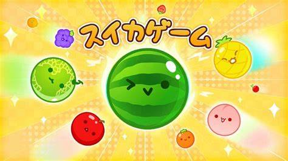
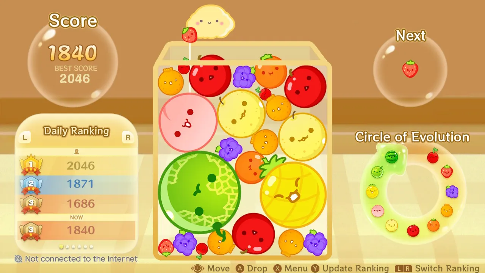

<!-- Improved compatibility of back to top link: See: https://github.com/othneildrew/Best-README-Template/pull/73 -->

<!-- PROJECT SHIELDS -->
<!--
*** I'm using markdown "reference style" links for readability.
*** Reference links are enclosed in brackets [ ] instead of parentheses ( ).
*** See the bottom of this document for the declaration of the reference variables
*** for contributors-url, forks-url, etc.
-->
[![Contributors][contributors-shield]][contributors-url]
[![Forks][forks-shield]][forks-url]
[![Stargazers][stars-shield]][stars-url]
[![Issues][issues-shield]][issues-url]
[![MIT License][license-shield]][license-url]
[![LinkedIn][linkedin-shield]][linkedin-url]

<!-- PROJECT LOGO -->
 

  

<h3 align="center">Suika_Symphony</h3>

  

    Suika_Symphony is our Game Dev project for 2023 MHacks, and we're glad you are here to check it out! https://kevinh05.github.io/suika-notes/
     
    <a href="https://github.com/kevinh05/suika-notes"><strong>Explore the docs »</strong></a>
     
     
    <a href="https://kevinh05.github.io/suika-notes/">View Demo</a>
    ·
    <a href="https://github.com/kevinh05/suika-notes/issues">Report Bug</a>
    ·
    <a href="https://github.com/kevinh05/suika-notes/issues">Request Feature</a>
  

<!-- TABLE OF CONTENTS -->

  
Table of Contents

  <ol>
    <li>
      <a href="#about-the-project">About The Project</a>
      <ul>
        <li><a href="#built-with">Built With</a></li>
      </ul>
    </li>
	<li><a href="#getting-started">Usage</a></li>
    <li><a href="#roadmap">Roadmap</a></li>
    <li><a href="#contributing">Contributing</a></li>
    <li><a href="#license">License</a></li>
    <li><a href="#contact">Contact</a></li>
    <li><a href="#acknowledgments">Acknowledgments</a></li>
  </ol>

<!-- ABOUT THE PROJECT -->
## About The Project

**What is Suika?**

Suika is a viral game that has taken the innternet by storm over the past two weeks. It is equal-parts satisfying and frustrating, and is always extremely hard to put down. We wanted 

Suika Symphony is an innovative project that transforms the traditional Suika game into an engaging educational tool for children to learn and understand music theory. Developed for the MHacks hackathon, Suika Symphony combines the excitement of the original game with educational elements, creating a fun and interactive platform for young learners.

**What is Suika Symphony**

Instead of conventional fruit slices, Suika Symphony features musical notes that combine in fun and accurate ways. Each slice corresponds to a specific note on the musical scale or to a specific measure of musical time.

**Chord Challenges:**

Players engage in musical challenges where they must hit the correct fruit notes in sequence to create chords. In the future, the successful completion of challenges advances players to more complex musical compositions. Currently, a diverse collection of chords can be made including five different tri-tones and twelve different two-note combinations. 

**Rhythm and Timing:**

Suika Symphony incorporates rhythm and timing elements into the gameplay, helping children develop a sense of musical timing and coordination as they slice through the musical fruits along to the groovy background music.

**Interactive Lessons:**

The game includes interactive lessons on fundamental music theory concepts such as pitch and tempo. These lessons are seamlessly integrated into the gameplay, ensuring an immersive learning experience.

**Virtual Music Instructor:**

One goal for the future is to implement a virtual music instructor that can guide players through the game, providing feedback, tips, and encouragement. This character serves as a mentor, making the learning process more engaging and enjoyable, and would be based of a language model API.

**Customizable Learning Paths:**

Suika Symphony allows customization of learning paths based on the child's age and skill level, ensuring that the educational content aligns with individual learning needs.

**Educational Goals:**

Suika Symphony aims to achieve the following educational objectives:

Introduce children to the basics of music theory in a playful and entertaining manner.
Foster a love for music by making learning an enjoyable experience.
Develop essential cognitive skills such as memory, attention, and coordination through gameplay.
Provide a foundation for future music education endeavors.

**Why Suika Symphony?**

Suika Symphony is not just a game; it's a creative approach to make music education accessible and enjoyable for children. By combining the excitement of the Suika game with educational content, Suika Symphony empowers young minds to embark on a musical journey while having a blast at the same time.

(<a href="#readme-top">back to top</a>)

### Built With

* [![Unity][Unity.com]][Unity-url]
* [![Adobe][Adobe.com]][Adobe-url]
* [![Github][Github.com]][Github-url]
<!-- * [![Next][Next.js]][Next-url]
* [![React][React.js]][React-url]
* [![Vue][Vue.js]][Vue-url]
* [![Angular][Angular.io]][Angular-url]
* [![Svelte][Svelte.dev]][Svelte-url]
* [![Laravel][Laravel.com]][Laravel-url]
* [![Bootstrap][Bootstrap.com]][Bootstrap-url]
* [![JQuery][JQuery.com]][JQuery-url] -->

(<a href="#readme-top">back to top</a>)

<!-- GETTING STARTED -->
## Getting Started

All you need to do to get started playing our game is to follow this link:

https://kevinh05.github.io/suika-notes/

We hosted our game on github pages, so it is integrated seamlessly with your web browser using WebGL

<!-- ROADMAP -->
## Roadmap

- [ ] Mp4 analysis and automatic level construction
- [ ] Dynamic music following chord construction upon merging notes
- [ ] Powerup implementation
    - [ ] Fermata Freeze
	- [ ] Scherzo Splitting
	- [ ] Mezzo Magic
	- [ ] ...

See the [open issues](https://github.com/kevinh05/suika-notes/issues) for a full list of proposed features (and known issues).

(<a href="#readme-top">back to top</a>)

<!-- CONTRIBUTING -->
## Contributing

Contributions are what make the open source community such an amazing place to learn, inspire, and create. Any contributions you make are **greatly appreciated**.

If you have a suggestion that would make this game better, please fork the repo and create a pull request. You can also simply open an issue with the tag "enhancement".
Don't forget to give the project a star! Thanks again!

1. Fork the Project
2. Create your Feature Branch (`git checkout -b feature/AmazingFeature`)
3. Commit your Changes (`git commit -m 'Add some AmazingFeature'`)
4. Push to the Branch (`git push origin feature/AmazingFeature`)
5. Open a Pull Request

(<a href="#readme-top">back to top</a>)

<!-- LICENSE -->
## License

Distributed under the MIT License. See `LICENSE.txt` for more information.

(<a href="#readme-top">back to top</a>)

<!-- CONTACT -->
## Contact

The Team: Shaan Doshi, Kevin Huang, Jack Morby, Henry Piper

Emails: shaandoshi4@gmail.com, kh47@illinois.edu jmorby2@illinois.edu, hjpiper2@illinois.edu

Project Link: [https://github.com/kevinh05/suika-notes](https://github.com/kevinh05/suika-notes)

(<a href="#readme-top">back to top</a>)

<!-- ACKNOWLEDGMENTS -->
## Acknowledgments

* A big thank you to Bo, Hans, and the other mentors that helped get us off the ground with app development
* Forever indebted to UMich for the hearty sandwiches that kept us fueled during the day
* Big shoutout to A Fleming on YouTube for his great video on how to host a WebGL Unity Game on a Github Page

(<a href="#readme-top">back to top</a>)

<!-- MARKDOWN LINKS & IMAGES -->
<!-- https://www.markdownguide.org/basic-syntax/#reference-style-links -->
[contributors-shield]: https://img.shields.io/github/contributors/kevinh05/suika-notes.svg?style=for-the-badge
[contributors-url]: https://github.com/kevinh05/suika-notes/graphs/contributors
[forks-shield]: https://img.shields.io/github/forks/kevinh05/suika-notes.svg?style=for-the-badge
[forks-url]: https://github.com/kevinh05/suika-notes/network/members
[stars-shield]: https://img.shields.io/github/stars/kevinh05/suika-notes.svg?style=for-the-badge
[stars-url]: https://github.com/kevinh05/suika-notes/stargazers
[issues-shield]: https://img.shields.io/github/issues/kevinh05/suika-notes.svg?style=for-the-badge
[issues-url]: https://github.com/kevinh05/suika-notes/issues
[license-shield]: https://img.shields.io/github/license/kevinh05/suika-notes.svg?style=for-the-badge
[license-url]: https://github.com/kevinh05/suika-notes/blob/master/LICENSE.txt
[linkedin-shield]: https://img.shields.io/badge/-LinkedIn-black.svg?style=for-the-badge&logo=linkedin&colorB=555
[linkedin-url]: https://linkedin.com/in/jack-morby
[product-screenshot]: images/screenshot.png
[Unity.com]: https://img.shields.io/badge/Unity-000000?style=for-the-badge&logo=unity&logoColor=white
[Unity-url]: https://unity.com/
[Adobe.com]: https://img.shields.io/badge/Adobe-DD0031?style=for-the-badge&logo=Adobe&logoColor=white
[Adobe-url]: https://adobe.com/
[Github.com]: https://img.shields.io/badge/Github_Pages-4A4A55?style=for-the-badge&logo=Github&logoColor=white
[Github-url]: https://github.com/
